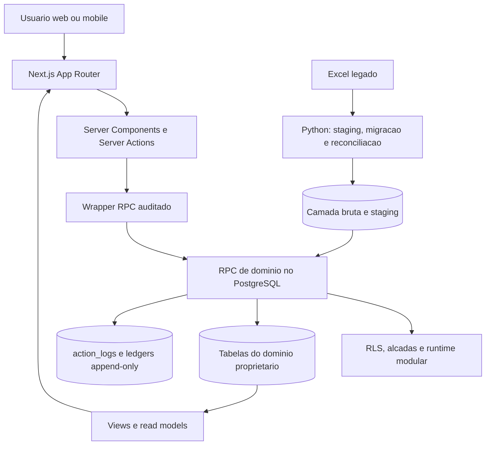
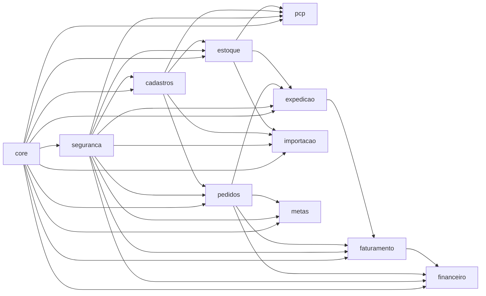
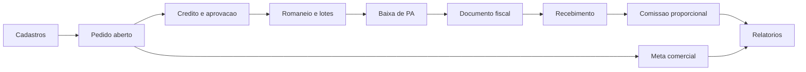
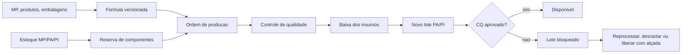
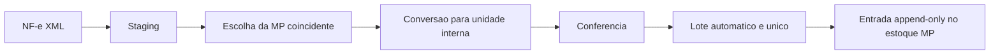

# Elite System - arquitetura geral

## Finalidade deste mapa

Este e o ponto inicial para localizar qualquer trabalho no Elite System. Ele resume a arquitetura vigente, os modulos, os limites de propriedade, as dependencias, os fluxos e a maturidade. Documentos detalhados em `docs/` preservam as decisoes e validacoes; este arquivo apenas as organiza.

O codigo e o banco continuam sendo a fonte executavel. Se este mapa divergir deles, a tarefa deve parar, corrigir a divergencia e registrar a decisao antes de continuar.

## Baseline validada

- Stack operacional: Next.js 16, TypeScript, Supabase e PostgreSQL; Vercel planejada para o frontend cloud.
- Ferramentas historicas: Python para importacao, auditoria e reconciliacao do Excel; SQLite nao e o banco operacional novo.
- Ultima migration desta baseline: `0044_production_module_release.sql`.
- Ambiente local autoritativo em 2026-07-11: `test`.
- Modulos em validacao de negocio no banco de teste: `cadastros`, `estoque` e `pcp`.
- `core` e `seguranca` estao operacionais no banco de teste.
- Demais modulos estao em validacao tecnica; nenhum modulo foi promovido para banco operacional de producao.
- CI reconstrui todas as migrations do zero, executa lint SQL, smokes, testes Python, lint e build web.
- GitHub recebe somente codigo e documentacao sem dados comerciais.

A tela `/modulos` consulta o estado atual do PostgreSQL. Em caso de diferenca, a tela e os ledgers do banco prevalecem sobre este retrato datado.

## Arquitetura em uma imagem

## Camadas e direcao permitida

| Camada | Responsabilidade | Pode chamar | Nao pode fazer |
|---|---|---|---|
| Tela | Apresentacao, formularios e leitura | Server Action ou query tipada | Gravar tabela diretamente |
| Aplicacao web | Sessao, entrada e orquestracao curta | Wrapper RPC e queries permitidas | Reimplementar regra de negocio SQL |
| RPC de dominio | Validacao, alçada, transacao e auditoria | Tabelas/APIs internas dos dominios | Ignorar dominio proprietario |
| Dominio proprietario | Estado e invariantes do modulo | Suas tabelas e contratos publicados | Aceitar escrita externa direta |
| Read model | Consulta transversal e relatorio | Views/tabelas autorizadas por RLS | Alterar fato operacional |
| Python historico | Importacao, reconciliacao e manutencao | Staging e RPC governada | Tornar SQLite banco operacional |

Direcao obrigatoria: `tela -> aplicacao -> RPC auditada -> dominio proprietario -> evento/log`.

## Catalogo de modulos

| Chave | Modulo e responsabilidade objetiva | Dono/tabelas | Dependencias diretas | Tela principal | Baseline |
|---|---|---|---|---|---|
| `core` | Sessao, health-check, painel e runtime central | `sys_*` | nenhuma | `/` e `/modulos` | operacional em teste |
| `seguranca` | Usuarios, convites, senha, perfis, alcadas e auditoria de acesso | `user_profiles`, permissoes, `action_logs` | `core` | `/seguranca` | operacional em teste |
| `cadastros` | Clientes, propriedades, contatos, pessoas, MP, produtos, embalagens e conversoes | `cad_*` | `core`, `seguranca` | `/cadastros` | validacao de negocio |
| `pedidos` | Pedido, itens, credito, comissionados, transicoes e Kanban | `com_pedidos`, `com_pedido_*` | `core`, `seguranca`, `cadastros` | `/pedidos`, `/kanban` | validacao tecnica |
| `estoque` | Lotes MP/PA/PI, reservas, movimentos, reversoes e saldos derivados | `est_*` | `core`, `seguranca`, `cadastros` | integrado em `/producao` e `/romaneios` | validacao de negocio |
| `pcp` | Formulas, OP, reserva/consumo, CQ, garantias e transformacoes | `pcp_*` | `core`, `seguranca`, `cadastros`, `estoque` | `/producao` | validacao de negocio |
| `expedicao` | Romaneio total/parcial, separacao multilote, confirmacao e estorno | `exp_*` | `core`, `seguranca`, `pedidos`, `estoque` | `/romaneios` | validacao tecnica |
| `importacao` | Staging de NF XML, match de MP, conversao e geracao de lote | `imp_*` | `core`, `seguranca`, `cadastros`, `estoque` | `/importacao-xml` | validacao tecnica |
| `faturamento` | NF total, simples faturamento, remessa vinculada, complemento e eventos fiscais | `fat_*` | `core`, `seguranca`, `pedidos`, `expedicao` | integrada ao pedido; tela dedicada pendente | validacao tecnica |
| `financeiro` | Recebimentos, alocacoes, liberacao proporcional e conta corrente de comissao | `fin_*` e contratos financeiros | `core`, `seguranca`, `pedidos`, `faturamento` | integrada ao pedido; tela dedicada pendente | validacao tecnica |
| `metas` | Periodos customizados e ledger de vendas, cancelamentos e devolucoes | `com_meta_*` | `core`, `seguranca`, `pedidos` | tela dedicada pendente | validacao tecnica |
| `relatorios` | Read models, reconciliacoes, vendas, estoque e rastreabilidade | views `rel_*` | leitura opcional dos dominios operacionais | `/relatorios` | validacao tecnica |
| `auditoria` | Fonte historica, batches, issues, reconciliacao e evidencias de migracao | `source_*`, `migration_*` | leitura controlada dos dominios | ferramentas Python e relatorios | validacao tecnica |

## Grafo de dependencias obrigatorias

`relatorios` e `auditoria` leem varios dominios, mas nao possuem escrita operacional sobre eles.

## Fluxos que formam a imagem mental do sistema

### Venda ate recebimento

### Producao e transformacao

### Entrada de materia-prima por XML

### Migracao historica sem perda

## Progresso: o que cada estado significa

O sistema nao usa porcentagens inventadas. A maturidade e um gate objetivo do banco:

| Estado | Significado | Evidencia minima |
|---|---|---|
| `construction` | Estrutura ainda incompleta | codigo em elaboracao |
| `technical_validation` | Contrato tecnico funciona | migrations, testes, lint e build |
| `business_validation` | Pronto para conferencia do processo real | tela operavel e cenarios de negocio |
| `pilot` | Uso controlado com poucos usuarios | operacao paralela, suporte e reconciliacao |
| `operational` | Liberado no ambiente produtivo | homologacao, backup restaurado, monitoramento e aceite |
| `suspended` | Retirado de uso | evento auditado com motivo |

O acesso (`disabled`, `read_only`, `read_write`) e independente da maturidade. Um modulo pode estar tecnicamente pronto e continuar bloqueado no ambiente produtivo.

## Invariantes nao negociaveis

1. Banco novo nasce fechado e rota nova autenticada nasce negada ate ser catalogada.
2. RLS protege leitura; escrita operacional ocorre somente por RPC governada.
3. Toda escrita critica registra ator, action key, alçada, antes/depois e correlation id quando composta.
4. Movimento de estoque, evento fiscal/financeiro, meta, formula publicada e historico de rollout nao sao editados; correcao gera evento novo.
5. Saldo e derivado dos movimentos. Nao existe edicao direta de saldo.
6. Cada tabela possui um dominio proprietario. Escrita cruzada chama o contrato desse dominio.
7. Pedido aberto e romaneio em rascunho nao baixam estoque; romaneio confirmado baixa apenas o romaneado.
8. OP MAPA e documental. OP operacional reserva insumo, finaliza com CQ e gera o fato fisico mesmo quando o lote precisa ficar bloqueado.
9. Comissao nasce somente de venda, libera proporcionalmente ao recebimento e usa idempotencia por evento.
10. Git nunca recebe dado operacional, senha, chave, workbook ou banco.

## Localizador rapido por tipo de mudanca

| Pedido do usuario | Comece aqui | Leia depois somente se necessario |
|---|---|---|
| Tela de producao | `apps/web/app/pcp`, `apps/web/lib/pcp.ts` | migration/SQL de PCP e estoque chamado |
| MP/produto/embalagem | `apps/web/app/cadastros`, `apps/web/lib/master-data.ts` | migrations `cad_*` relevantes |
| Pedido/Kanban/credito | `apps/web/app/pedidos`, `apps/web/lib/orders.ts`, `apps/web/lib/kanban.ts` | RPC de pedido e transicao |
| Romaneio/lote de expedicao | `apps/web/app/romaneios`, `apps/web/lib/romaneios.ts` | contratos de reserva e movimento PA |
| XML de entrada MP | `apps/web/app/importacao-xml`, `apps/web/lib/importacao-xml.ts` | staging, conversao e API de estoque MP |
| Permissao/login/usuario | `apps/web/app/seguranca`, `apps/web/lib/security.ts` | migration de seguranca e wrapper RPC |
| Relatorio | `apps/web/app/relatorios`, `apps/web/lib/reports.ts` | view/read model do dominio fonte |
| Schema ou regra SQL | ultima migration relacionada e teste de contrato | migrations antigas apenas para origem do contrato |
| Migracao Excel | `elite_system/migration.py`, parsers e reconciliacao | staging e dominio de destino |

## Linha de trabalho reutilizavel

1. Ler este mapa e o `git status --short --branch`.
2. Classificar o pedido em um modulo proprietario.
3. Ler o ponto de entrada e uma camada abaixo; ampliar somente por dependencia declarada.
4. Confirmar a invariante afetada e usar o padrao existente.
5. Executar teste direcionado durante a mudanca.
6. Executar gate proporcional uma vez no fechamento.
7. Atualizar este mapa somente se modulo, dependencia, fluxo, invariante ou maturidade mudou.
8. Versionar codigo e documentacao; nunca dados.

Uma validacao so deve ser repetida se o codigo, o ambiente, o banco ou a entrada mudou; se a anterior falhou e foi investigada; ou se ela e o gate final de publicacao.

## Gates ainda necessarios para producao profissional

1. Homologacao visual e funcional dos modulos em `business_validation`.
2. Supabase e Vercel separados para desenvolvimento, homologacao e producao.
3. Backup automatico, recuperacao ponto a ponto e teste real de restauracao.
4. Monitoramento, alertas, runbook de incidente e rotacao de segredos.
5. Ensaio completo da migracao historica e reconciliacao contra o Excel.
6. Testes de concorrencia, carga, ponta a ponta e seguranca externa.
7. Piloto com poucos usuarios antes de promover qualquer modulo a `operational`.

## Documentos detalhados

- Propriedade dos dominios: `docs/matriz_propriedade_modulos.md`.
- Runtime e rollout: `docs/decisao_operacao_incremental_modulos.md`.
- Integridade relacional: `docs/decisao_gate_arquitetura_integridade.md`.
- Seguranca/RPC auditada: `docs/receita_rls_rpc_auditada.md`.
- Fluxo operacional: `docs/fluxo_operacional_elite_system.md`.
- Plano de construcao: `docs/plano_construcao_elite_system.md`.
- Publicacao de Producao: `docs/decisao_publicacao_modulo_producao.md`.
- Migracao historica: `docs/plano_migracao_sem_perda_historico.md`.
- Migracao historica de MP e valores de aquisicao: `docs/decisao_migracao_historica_materias_primas.md`.
- Evidencia desta consolidacao: `docs/validacao_mapa_arquitetural_workflow.md`.

## Regra de manutencao

O catalogo executavel em `apps/web/lib/system-map.ts`, as chaves de `sys_modules` na migration e esta tabela devem permanecer sincronizados. O teste `tests/test_architecture_navigation_contract.py` falha quando uma nova chave aparece sem mapa visual ou documentacao.
