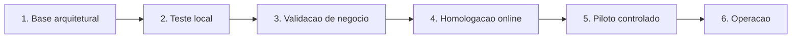
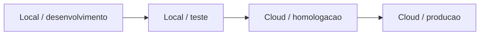

# Elite System - mapa de implantacao dos modulos

## Objetivo

Tornar o progresso compreensivel sem substituir os controles tecnicos. A tela
`/modulos` apresenta os gates, as dependencias e a proxima validacao de cada
bloco. O PostgreSQL permanece como fonte autoritativa de ambiente, maturidade,
acesso e historico de rollout.

Este mapa nao cria uma segunda fonte de status. Ele traduz o estado executavel
para uma leitura de negocio.

## Caminho ate a operacao

| Gate | O que precisa existir | Evidencia minima |
|---|---|---|
| Base arquitetural | modulo dono, dependencias, tabelas e invariantes | catalogo, ADRs, migrations e testes de arquitetura |
| Teste local | fluxo executavel sem dados de producao | smoke tests, lint, build e banco descartavel |
| Validacao de negocio | regra e tela conferidas por quem opera | cenarios homologados e pendencias registradas |
| Homologacao online | ambiente cloud separado e reproduzivel | deploy, Auth, RLS, auditoria, backup e restauracao |
| Piloto controlado | escopo e usuarios limitados | uso simultaneo, monitoramento e aceite |
| Operacao | liberacao gradual e reversivel | rollout auditado, alertas e runbook |

## Como ler a tela

1. `O que esta pronto e o que vem depois` mostra o caminho global.
2. `Da fundacao ao controle` localiza cada modulo e sua dependencia.
3. `Proxima validacao` informa a acao objetiva para o modulo avancar.
4. `Catalogo e dependencias` mostra o estado real retornado pelo banco.
5. Somente um usuario com `system.admin` pode promover o rollout.

Os percentuais visuais representam exclusivamente o lifecycle gravado no
banco. Eles nao medem horas, linhas de codigo nem uma estimativa inventada de
conclusao.

## Gates de um modulo

Um modulo so avanca quando o gate anterior possui evidencia:

- `construction`: implementacao ainda incompleta;
- `technical_validation`: contrato e fluxo em teste tecnico;
- `business_validation`: regra e tela aguardam ou executam homologacao;
- `pilot`: uso real limitado e monitorado;
- `operational`: liberado no ambiente selecionado;
- `suspended`: promocao interrompida por decisao auditada.

A maturidade nao libera escrita sozinha. O acesso efetivo tambem exige RLS,
permissao atomica, dependencias disponiveis e `access_mode` compativel.

## Ambientes

- local: desenvolvimento, analise do workbook e testes descartaveis;
- teste: validacao integrada antes de qualquer publicacao;
- homologacao: ambiente online sem dados operacionais reais;
- producao: operacao real, separada de homologacao.

O analisador integral do workbook continua local por desenho: ele processa um
arquivo administrativo no computador e nao deve enviar o Excel historico para
um frontend publico. A carga aprovada podera usar um processo administrativo
controlado e auditado.

## Regra de promocao

Toda promocao:

1. ocorre por RPC governada;
2. valida dependencias;
3. exige justificativa quando aplicavel;
4. grava evento append-only;
5. produz action log;
6. permite rollback por novo evento, sem apagar o historico.

## Limite desta entrega

Este documento e a tela nao declaram que o Elite System esta em producao. A
homologacao cloud exige projeto Supabase e projeto Vercel separados, variaveis
de ambiente protegidas, migrations aplicadas, Auth configurado e smoke tests.
